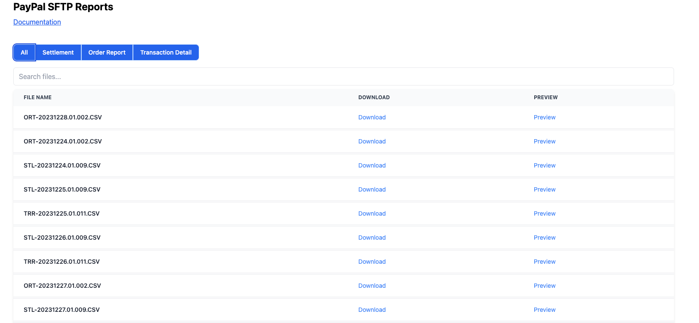
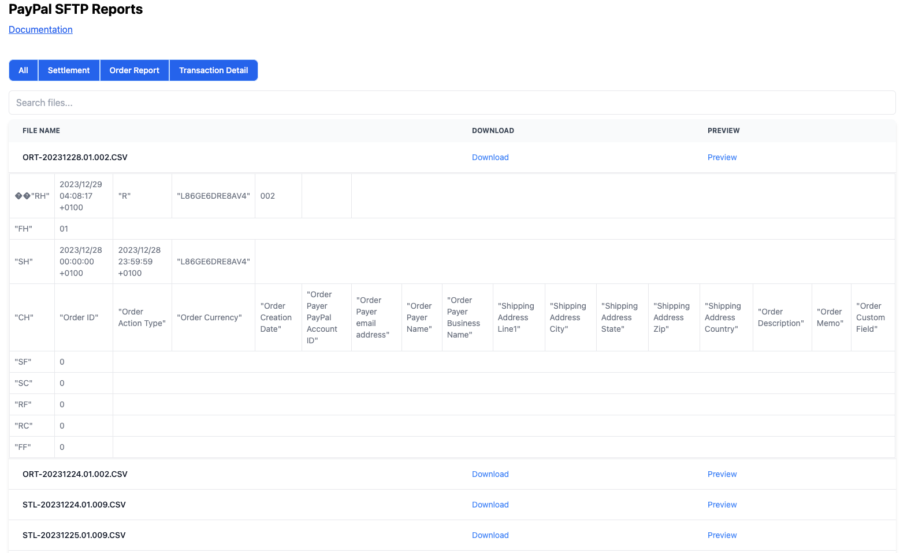
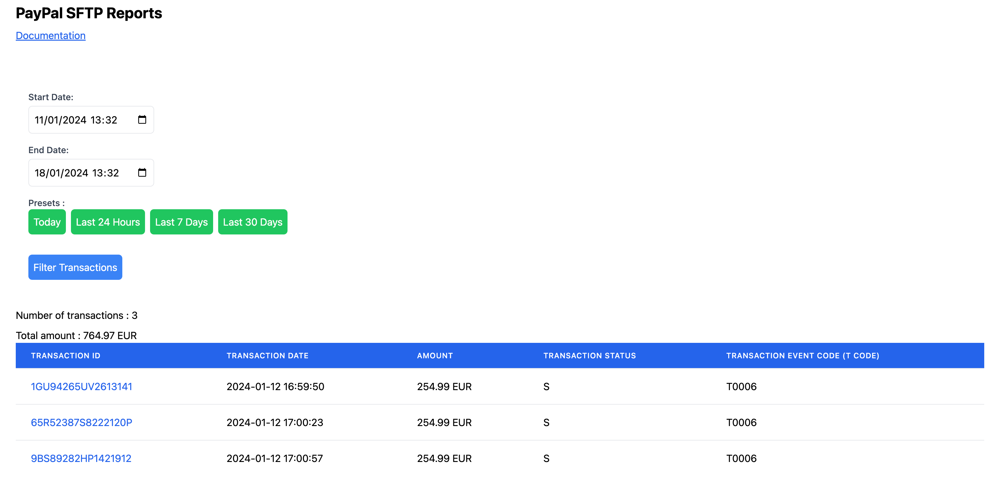

# PayPal SFTP reports panel

PayPal SFTP documentation: [https://developer.paypal.com/docs/reports/sftp-reports/](https://developer.paypal.com/docs/reports/sftp-reports/)
PayPal List Transactions: [https://developer.paypal.com/docs/api/transaction-search/v1/#search_get](https://developer.paypal.com/docs/api/transaction-search/v1/#search_get)

## Installation

1. Clone the repository
2. Install dependencies: `npm install`

## Configuration

Duplicate `.env.exemple` to a `.env` file at the root of the project and add the necessary environment variables.

## How to Run

To start the project, run the following command:

```bash
npm start
```

## Screenshots

- SFTP Reports
<br />



<br />



<br />
<br />

- List Transactions
<br />


